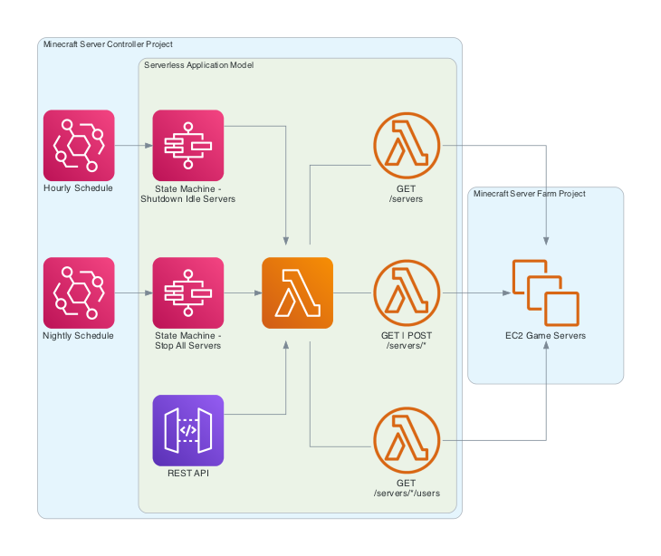

# Minecraft Server Controller

Resources for managing a [Minecraft server farm](https://github.com/cpolanec/minecraft-server-farm) (e.g. getting server and user information, shutting down idle servers, etc.)

## Overview

This application is mainly a set of Lambda functions that are chained together into workflows. These workflows are meant to save compute costs and backup game data. Here is a breakdown the main application components:

| Component        | Value                                                           |
| ---------------- | --------------------------------------------------------------- |
| Lambda functions | Foundational capabilities for interacting with the game servers |
| API Gateway      | Simple means to invoke/integrate the Lambda functions           |
| Step Functions   | Combine the functions into useful workflows                     |
| Event Bridge     | Triggers the Step Function workflows                            |

The following diagram provides more details on the AWS service integrations involved in this application deployment:

## Getting Started

The following instructions can help get this repo running in your AWS account:

1. [Configure local development environment](./docs/configure-dev-env.md)
1. [Prepare your AWS account](./docs/prepare-aws-account.md)
1. [Define local environment variables](./docs/define-env-variables.md)
1. [Learn `Makefile` rules to deploy the app](./docs/learn-makefile-rules.md)
1. [Run the API methods](./docs/run-api-methods.md)

## More Information

The following resources are also available:

- [Contribution Guide](./CONTRIBUTING.md) for information about contributing to this project.
- [GitHub Issues](https://github.com/cpolanec/minecraft-server-controller/issues) for searching known issues or reporting new issues
- [GitHub Discussions](https://github.com/cpolanec/minecraft-server-controller/discussions) for discussing existing functionality or proposing new functionality
